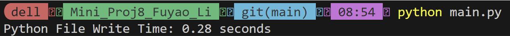
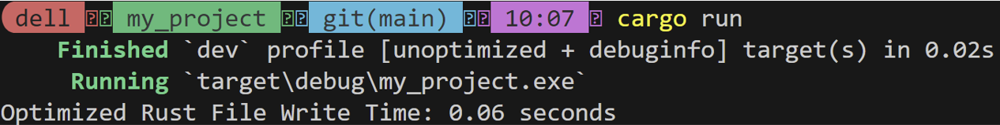

[](https://github.com/nogibjj/Mini_Proj8_Fuyao_Li/actions/workflows/rust_cicd.yml)
[](https://github.com/nogibjj/Mini_Proj8_Fuyao_Li/actions/workflows/python_cicd.yml)

## Mini_Project8

Author: Fuyao Li

## Requirements:
+ Take an existing Python script for data processing
+ Rewrite it in Rust
+ Highlight improvements in speed and resource usage

## Rust Implementation:
### File I/O in Rust
Rust’s standard library provides robust tools for file I/O through the `std::fs` and `std::io` modules. The `File` struct is used to open, create, read, and write files. `BufReader` can be used for buffered line-by-line reading. For writing, `File::create` opens a file in write mode, and `write!` or `writeln!` macros can be used to write formatted data. `BufWriter` wraps around `File` to improve performance by buffering writes in memory before committing them to disk, reducing the number of I/O operations. Rust’s file I/O is designed with safety and performance in mind, ensuring that errors are handled gracefully through the `Result` type, which helps developers build robust, error-resistant applications.

### Rust Preparation:
+ Build: `cargo build`
+ Run: `cargo run`
+ Test: `cargo test`

### `my_project` Structure  
```plaintext
my_project
├── Cargo.toml
├── src
│   └── main.rs
|   └── lib.rs
└── tests
    └── test_benchmark.rs
```

## Python Implementation:
Python provides file I/O capabilities through built-in functions like open, which is used to create, read, or write files. In this example, open is used in write mode to create a file, and f.write writes data line-by-line, while buffering helps optimize performance. 

### Python Preparation:
+ Build environment: `pip install -r requirements.txt`
+ Run: `python main.py`

## Speed and Resource Usage



The I/O running time for Python is 0.28 seconds, while Rust completes the same operation in 0.06 seconds, showing a significant performance advantage for Rust. This difference mainly arises from how each language handles system-level operations:

+ Language Compilation: Rust is a compiled systems language, which generates highly optimized machine code. This results in faster execution times compared to Python, which is an interpreted language and incurs overhead from its runtime environment.

+ I/O Buffering: Both implementations use buffering (BufWriter in Rust and open with default buffering in Python), but Rust’s BufWriter is closer to the system’s low-level I/O operations, enabling finer control and more efficient interaction with the filesystem. Python’s I/O, while buffered, operates through multiple layers in the interpreter, adding additional overhead.

+ Memory Safety and Concurrency: Rust’s memory safety guarantees and lack of a garbage collector allow it to allocate and release resources more predictably and efficiently. Python’s garbage collector and dynamic typing introduce additional delays, especially in large-scale file operations.
