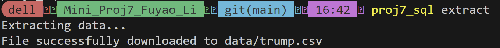
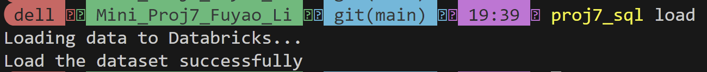
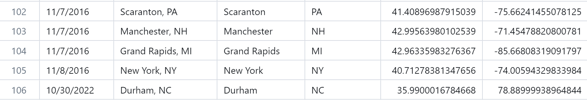
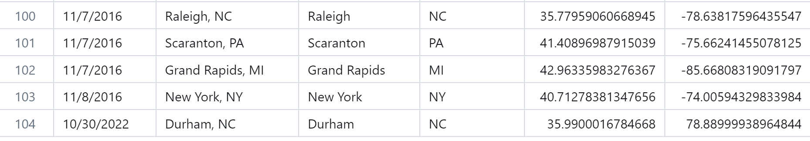

[](https://github.com/nogibjj/Mini_Proj7_Fuyao_Li/actions/workflows/cicd.yml)
## Mini_Project7

Author: Fuyao Li

### Requirements:
+ Package a Python script with setuptools or a similar tool
+ Include a user guide on how to install and use the tool
+ Include communication with an external or internal database (NoSQL, SQL, etc)

### Preparation:
+ Built virtual environment: `pip install -r requirements.txt`
+ Extract a dataset from a URL: `extract.py`
+ Load from a CSV file, transform it: `transform_load.py`

### Install 
```shell
python setup.py develop
```

### Usage
Once installed, you can use `proj7_sql` from the command line. The basic syntax is:
```shell
proj7_sql <action> [<args>] 
```

#### Actions
1. Extract
```shell
proj7_sql extract
```


2. Load
```shell
proj7_sql load
```


3. Insert
```shell
proj7_sql insert 10/30/2016 "Durham, NC" Durham NC 35.99 78.89
```


4. Update
```shell
proj7_sql update Durham 10/30/2022
```



5. Delete
```shell
proj7_sql delete Manchester
```



### References:
https://github.com/nogibjj/sqlite-lab
### Data resource:
https://github.com/fivethirtyeight/data/blob/master/presidential-campaign-trail/trump.csv
